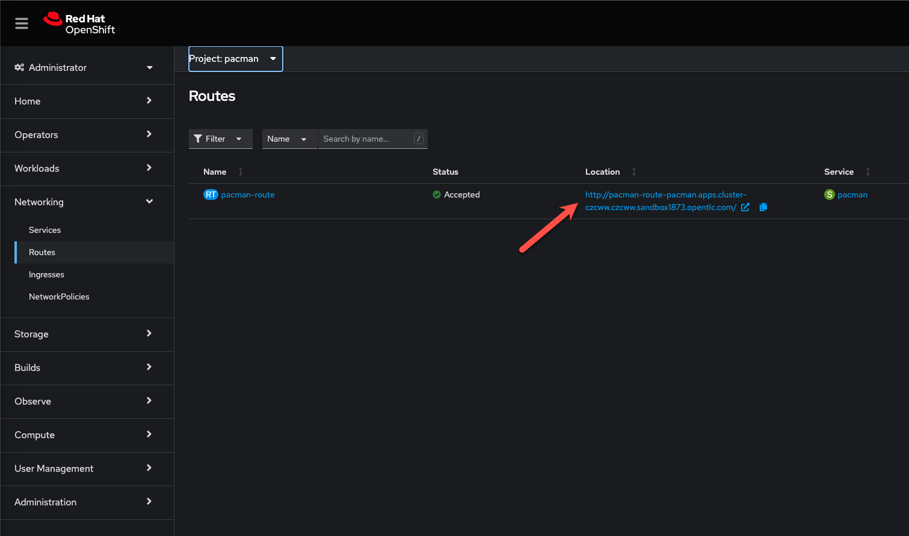

📖 Part 1. Deploying Pacman with Helm
======================================

1. Using the bastion host, begin by creating a new namespace for your application:

    ```bash
    oc create namespace pacman
    ```

2. Add the repository to install Pacman:

    ```
    helm repo add pacman https://shuguet.github.io/pacman/
    helm repo update
    ```

3. Run the following to install the `pacman/pacman` Helm Chart:

    ```bash
    helm install pacman pacman/pacman -n pacman \
    --set route.create=true \
    --set mongodb.containerSecurityContext.enabled=false \
    --set mongodb.podSecurityContext.enabled=false
    ```

    *It will take a few moments for the command to return, this is normal!*

5. Return to the OpenShift Console in your browser and verify the Chart has successfully provisioned 3 Pods, `pacman-*` and `pacman-mongodb-*`

    

    {: .note }
    Ensure you have the pacman project selected in the Project drop-down


📖 Part 2. Let's Play some Pacman
======================================

1. Now that our pacman application has been deployed, let's play some pacman. First we need to access the Pacman front end.  To find the URL, within the OpenShift console and navigate within the OpenShift console to Networking > Routes

2. Ensure you have the pacman project selected.  You should see an entry named pacman-route

    

3. Click on the Location to launch pacman

4. Play a short game, and enter your name once you're done to add your name to the leaderboard.

    

    

🏁 Part 3. Takeaways
====================
- Deploying applications from helm charts is quick and easy
- OpenShift makes exposing applications via routes simple
- Pacman is still fun

<div>
Continue to 
<a style="z-index:999999;padding:7px 15px;border-width:2px;border-style:solid;border-radius:8px;font-weight:600;font-size:18px;filter:drop-shadow(0px 0px 15px rgba(26, 19, 72, 0.25));font-family:Guardian Sans, Arial, sans-serif;white-space:nowrap;overflow:hidden;text-overflow:ellipsis;cursor:pointer;background:#4C5BDC;border-color:#FFFFFF;color:#FFFFFF" href="./lab2_k10_configure">LAB 2</a>
</div>