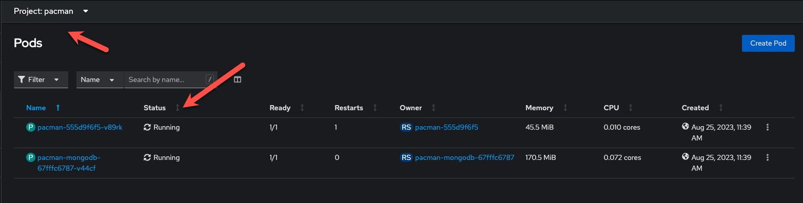

📖 Part 1. Deploying Pacman with Helm
======================================

1. Using the bastion host, begin by creating a new namespace for your application:

    ```bash
    kubectl create namespace pacman
    ```

2. Add the repository that will be used to install the `mongodb` Helm Chart:

    ```
    helm repo add pacman https://shuguet.github.io/pacman/
    helm repo update
    ```

3. Open a new terminal on the bastion host and start a `--watch` command to monitor Pod changes in the `pacman-ha` namespace:

    ```bash
    kubectl get pods -n pacman -o wide --watch
    ```

    *You should not expect the command to return anything immediately as there are currently no Pods in `pacman`*.

4. Switch to the original terminal and run the following to install the `pacman/pacman` Helm Chart with a highly available architecture:

    ```bash
    helm install pacman pacman/pacman -n pacman --set route.create=true
    ```

    *It will take a few moments for the command to return, this is normal!*

5. Return to the second terminal and verify the Chart has successfully provisioned 3 Pods, `pacman-*` and `pacman-mongodb-*`

    


📖 Part 2. Let's Play some Pacman
======================================

1. Now that our pacman application has been deployed, let's play some pacman. First we need to access the Pacman front end.  To find the URL, within the bastion host, open a browser and navigate within the OpenShift console to Networking > Routes

2. Ensure you have the pacman project selected.  You should see an entry named pacman-route

    

3. Click on the Location to launch pacman

4. Play a short game, and enter your name once you're done to add your name to the leaderboard.

    

🏁 Part 3. Takeaways
====================
- Deploying applications from helm charts is quick and easy
- OpenShift makes exposing applications via routes simple
- Pacman is still fun

Click ***Next*** to proceed to the next exercise.