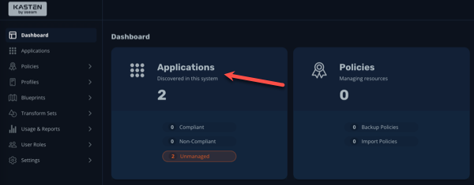

📖 Part 1. Configure cluster storage for K10
======================================
*Prior to configuring backups, we need to ensure our cluster storage is capable of performing snapshots of our persistent data workloads.
Because our cluster is deployed on top of Amazon EC2, we can leverage EBS storage and it's associated CSI driver to perform volume snapshot operations.

To do so, we need to ensure our VolumeSnapshotClass object created on the cluster for the ebs.csi.aws.com provisioner is correctly annotated.  We need to add the annotation
_k10.kasten.io/is-snapshot-class: "true"_

1. On the bastion host, run the following command to patch the csi-aws-vsc VolumeSnapshotClass so K10 can use it to perform snapshot operations

    ```bash
    oc annotate volumesnapshotclass $(oc get volumesnapshotclass \
    -o=jsonpath='{.items[?(@.metadata.annotations.snapshot\.storage\.kubernetes\.io\/is-default-class=="true")].metadata.name}') \
    k10.kasten.io/is-snapshot-class=true
    ```

2. Run the following command to validate the VolumeSnapshotClass has been annotated

    ```bash
    oc get volumesnapshotclasses.snapshot.storage.k8s.io csi-aws-vsc -o yaml
    ```

📖 Part 2. Configure an S3-compatible Object Store for Backup
======================================

*Before we can begin protecting our apps, we need to define a location for Kasten to export backup off of the cluster and primary storage.*

*As part of the lab environment staging, a MinIO Object Storage server has already been deployed to your cluster. This server provides a single bucket, `kasten-bucket`, that you will use as a backup target.*

  > 🚩 ***WARNING***
  >
  > This is a lab environment. In production, exporting your backups to the same storage as what you're trying to protect would really defeat the purpose - don't you think?

1.  Find the URL of the Kasten instance by navigating to Networing > Routes in the OpenShift console. Click the Location URL
    
    *Ensure you have the kasten-io project selected*

2.  When prompted for login details, enter the following:

      | **Username** | **Password** |
      |---|---|
      | kasten | kasten123 |

3. When prompted, enter your email and organization and accept the EULA:
   

4. Take a quick tour if you'd like, otherwise just click "No, Thanks"

    

5.  From the ***K10 Dashboard*** tab, select ***Settings***.

    

6. Under ***Locations***, click the ***+ New Profile*** button.

7. From the environment configuration details for your cluster, copy the hostname of your bastion host to your clipboard (the part after _lab-user@_). It should look similar to:

    ```bash
    bastion.xyza.sandbox1234.opentlc.com
    ```

5. Fill out the following fields:

    | **Field** | **Value** |
    |---|---|
    | ***Profile Name*** | `minio` |
    | ***Storage Provider*** | Select *S3 Compatible*<br>(NOTE: This is a separate option from Amazon S3) |
    | ***S3 Access Key*** | `minioaccess` |
    | ***S3 Secret*** | `miniosecret` |
    | ***Endpoint*** | Type _http://_ Paste the URL from Step 2, followed by _:9000_<br>(eg. `http://<bastion_host_FQDN>:9000`) |
    | ***Skip certificate chain and hostname verification***| Leave unselected |
    | ***Region*** | us-east-2 |
    | ***Enable Immutable Backups*** | Leave unselected |
    | ***Bucket*** | kasten-bucket |

    

7. Verify the ***STATUS*** of your Location Profile is ***Valid***.

    

    *This indicates K10 was able to successfully authenticate and access the specified object storage bucket.*

📖 Part 3. Create A Policy
==========================

*Before performing a Kasten install, the "Primer Script" can quickly spot any potential problems with our cluster configuration.*

1. Click ***< Dashboard*** to return to the Kasten main dashboard, click ***Applications*** to view all applications discovered by K10 on the cluster.

    

2. Type `pacman` in the filter search bar, then click the ***Create a Policy*** button.

    

3. Leave the default name and optionally add a comment.  By default, the policy will generate hourly snapshots of the application with a standard retention policy. Leave these defaults.

4. Scroll down slightly and toggle ***Enable Backups via Snapshot Exports*** to the ON position and select `minio` as the ***Export Location Profile***.

    

5. Under ***Select Applications*** observe that we are explicitly protecting all resources in the `pacman` namespace.

    {: .note }
    A single Kasten policy can also protect multiple namespaces, and can even do so dynamically via Kubernetes labels.

6. Leave all other defaults and click ***Create Policy***.

    

7. You will be returned to the ***Policies*** page. On your new `pacman-backup` Policy, click the ***YAML*** button to view the Kubernetes manifest.

    

    As native Kubernetes resources, K10 policies, profiles, and even running backups or restores can be easily implemented via `oc` or API. Exposing the YAML through the UI makes it easy for administrators to copy and modify existing examples of K10 resources or actions.

8. Click ***Cancel*** to close the YAML window.


🏁 Part 4. Takeaways
====================

- Local snapshots are not backups
- Configuring off-cluster storage for backup is a good idea
- Configuring an S3-compatible bucket in Kasten K10 can be done in a few clicks
- Because Kasten is K8s-native, all actions, policies, resources can be implemented using oc commands or API

Using the menu to the left, click ***Lab 3 - Backup and Restore a Workload*** to proceed to the next exercise.