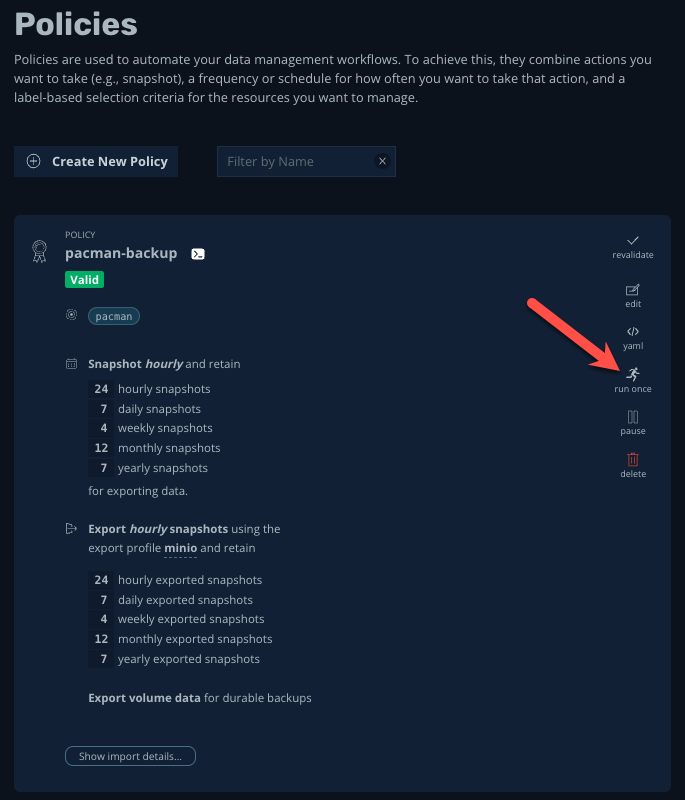
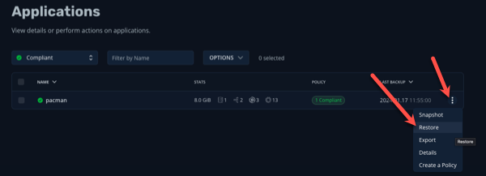
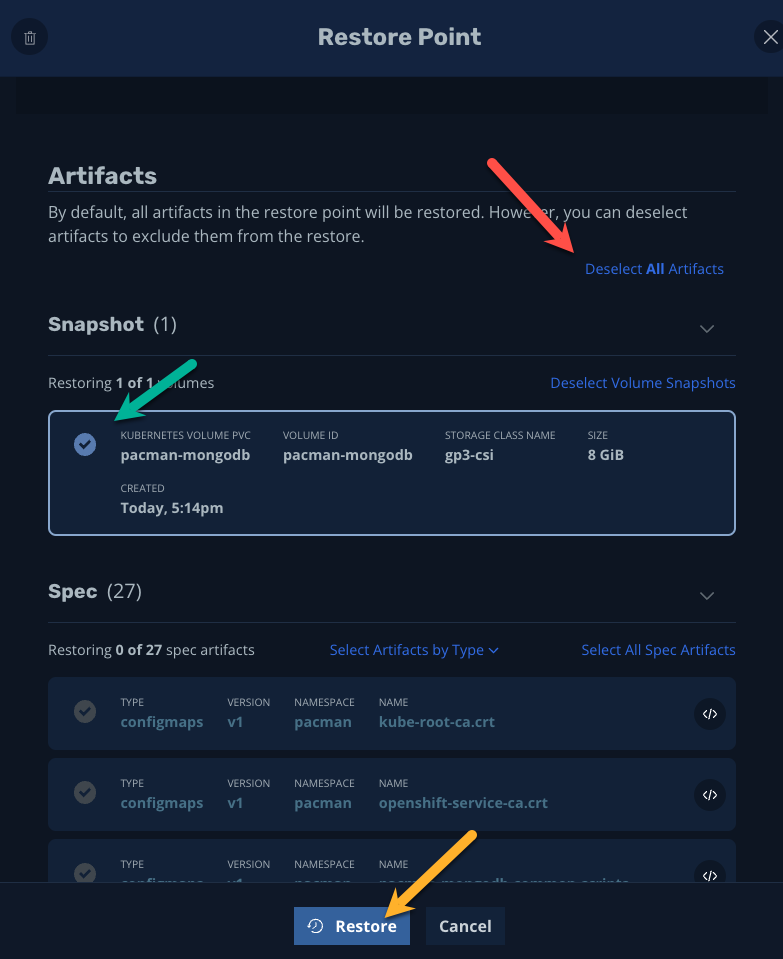

📖 Part 1. Peform a backup
======================================

*Before we can begin protecting our apps, we need to define a location for Kasten to export backup off of the cluster and primary storage.*

1. Under Policies, click _run once_ on the policy you created in lab 2, entitled _pacman-backup_

    

2. When prompted, leave the "Snapshot Expiration (Optional)" field blank and select, _Yes, Continue_

    

3. Click **< Dashboard** in the upper-left corner to monitor the action on the main dashboard

    

4. Click on the running action to monitor its detailed status

    

5. After a few minutes, all steps of the action should run successfully

    


Part 2. Scores Gone
=====================

1. Return to the Pacman tab in your browser and click "View Highscore List" or if the game is playing, hit the space bar and click **High Score**

    

2. From the bastion host, drop the `pacman` database from MongoDB that holds your highscore:

    ```bash
    export MONGODB_ROOT_PASSWORD=$(oc get secret -n pacman pacman-mongodb -o jsonpath="{.data.mongodb-root-password}" | base64 --decode)
    oc exec -it deploy/pacman-mongodb -n pacman -- mongosh pacman --authenticationDatabase admin -u root -p $MONGODB_ROOT_PASSWORD --eval 'db.dropDatabase();'
    ```

2. Return to the Pacman tab in your browser and refresh the page. Click __High Score__.
   __!!OH NO YOUR HIGH SCORE IS GONE!!__

    

Part 3. Recover Our Score
==========================

1. No fear, let's restore our backup.  Click on the Kasten K10 tab in your browser and return to the main dashboard by clicking on **< Dashboard**, click __Compliant__ in the Applications modal.

    

2. Click Restore on the Pacman application to restore from backup

    

3. Click the most recent backup.

    {: .note }
    There are two options from which to restore. The blue box is the local cluster backup, whereas the green box with the title "Exported" is the exported backup which is stored on our S3 object storage

    Click Today, #:## in the _blue box_ to restore from the local cluster snapshot

    

4. Scroll down and click **Deselect All Artifacts** then click the tick box next to the _pacman-mongodb_ item under the _Snapshot (1)_ section

    

5. Click Restore.

6. Return to the Dashboard by clicking on the **< Dashboard** link in the upper left corner, then click on the running Restore Action to monitor the action
   
6. After a minute or two all phases should complete successfully

    

7. Return to the pacman tab and refresh the tab.  Click **High Score**. Our high score is back!
   **REJOICE!**

    

🏁 Part 4. Takeaways
====================

- Kasten K10 automatically interrogates and detects namespaces on the cluster
- Backup jobs are configured on a per-namespace basis and can be configured quickly
- We can easily monitor actions via the Kasten UI
- We have granular control on how we restore from backup, including whether from on-cluster or exported storage
- We have granular control over which components we wish to recover and/or overwrite

Congratulations, you finished the Kasten K10 Demo on Red Hat OpenShift! To learn more visit [kasten.io](https://kasten.io)