📖 Part 1. Understanding Backups
============================================

In the previous labs, you saw how easily a user can setup Kasten and perform a basic backup and restore operation. In order to support the broad Kubernetes ecosystem of distributions and storage solutions, as well as the variety of stateful apps running on top, Kasten provides a number of methods for capturing data and ensuring its consistency.

The previous backup and restores were accomplished using the underlying storage's volumesnapshot capability to perform
our backup operation for the disks attached to our application, known as Persistent Volume Claims (PVCs). Kasten can create storage snapshots via any CSI driver that supports VolumeSnapshots API
or direct storage integrations with AWS EBS & EFS, Azure Managed Disks, GCP Persistent Disk, Ceph RBD, Cinder, vSphere Cloud Native Storage, and Portworx.

All of the objects in the namespace are also captured (e.g. deployment, secrets, configmaps, etc)

Because these backups are performed via storage-based snapshots, they are known as **Crash Consistent Backups**

  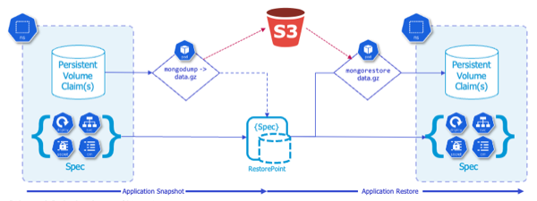

While this is great for our demo purposes and some applications, there are many workloads that require disk operations to be in a quiesced state
during backup, otherwise there is a risk of data corruption which can cause issues upon restore.

One such workload is **MongoDB**, which is the database backing our high scores in Pacman. And while MongoDB supports volume-level backup via snapshots, the database must be locked during the snapshot process in order to produce a dependable backup, or an **Application Consistent Backup**

Alternatively, rather than a storage-centric PVC backup, we could use app-specific native tools (e.g. `mongodump` and `mongorestore`) to directly export and restore data into our MongoDB at the same time we take a backup of our Kubernetes objects (deployments, secrets, configmaps, etc), which would be a **Logical Backup**

  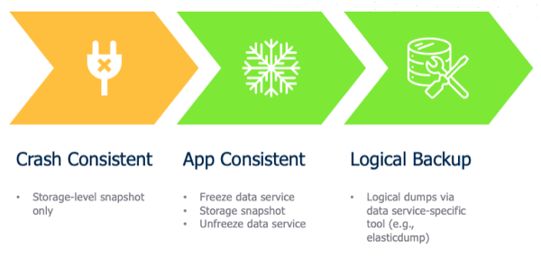

Fortunately Kasten has the capability to leverage a construct called [Kanister Blueprints](https://docs.kasten.io/latest/kanister/testing.html#installing-applications-and-blueprints), which provides a standardized way to perform more advanced operations for application consistent and logical backups. 

📖 Part 2. Creating a Blueprint and binding
============================================
The good news is our Pacman application leverages an underlying Bitnami instance of MongoDB, so we can simply modify that example blueprint for our purposes.

## Create a New Blueprint

1. Within the Kasten UI, navigate to **Blueprints > Blueprints** in the side menu

    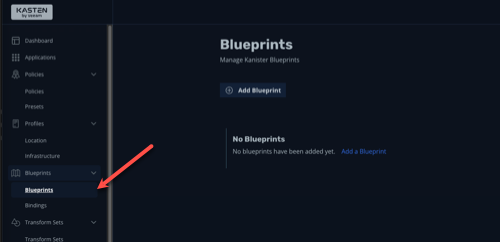

2. Click **+ Add Blueprint**

3. Paste the following into the YAML prompt:


        apiVersion: cr.kanister.io/v1alpha1
        kind: Blueprint
        metadata:
          name: mongo-hooks
        actions:
          backupPrehook:
            phases:
            - func: KubeExec
              name: lockMongo
              objects:
                mongoDbSecret:
                  kind: Secret
                  name: 'pacman-mongodb'
                  namespace: '{{ .Deployment.Namespace }}'
              args:
                namespace: "{{ .Deployment.Namespace }}"
                pod: "{{ index .Deployment.Pods 0 }}"
                container: mongodb
                command:
                - bash
                - -o
                - errexit
                - -o
                - pipefail
                - -c
                - |
                  export MONGODB_ROOT_PASSWORD='{{ index .Phases.lockMongo.Secrets.mongoDbSecret.Data "mongodb-root-password" | toString }}'
                  mongosh --authenticationDatabase admin -u root -p "${MONGODB_ROOT_PASSWORD}" --eval="db.fsyncLock()"
          backupPosthook:
            phases:
            - func: KubeExec
              name: unlockMongo
              objects:
                mongoDbSecret:
                  kind: Secret
                  name: 'pacman-mongodb'
                  namespace: '{{ .Deployment.Namespace }}'
              args:
                namespace: "{{ .Deployment.Namespace }}"
                pod: "{{ index .Deployment.Pods 0 }}"
                container: mongodb
                command:
                - bash
                - -o
                - errexit
                - -o
                - pipefail
                - -c
                - |
                  export MONGODB_ROOT_PASSWORD='{{ index .Phases.unlockMongo.Secrets.mongoDbSecret.Data "mongodb-root-password" | toString }}'
                  mongosh --authenticationDatabase admin -u root -p "${MONGODB_ROOT_PASSWORD}" --eval="db.fsyncUnlock()"

    {: .important }
    > In YAML, spacing is important, so ensure the formatting is copy and pasted correctly without modifications to the spaces

4. Click **Validate and Save**

    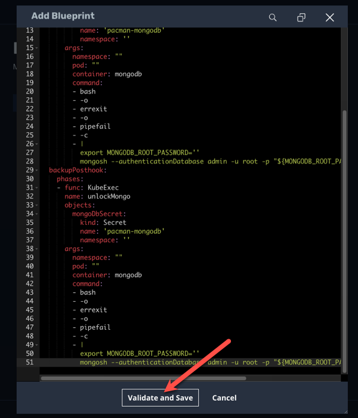

5. A new Blueprint named `mongo-hooks` should appear within the **Blueprints** list

    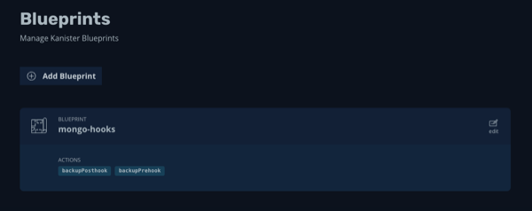

📖 Part 3. Binding our Blueprint
===================================================
Now that we have created our **Blueprint** we need to bind it to our application so that it is automatically run during backup, export, and restore operations. 

1. Using the side menu, navigate to **Blueprints > Bindings**

    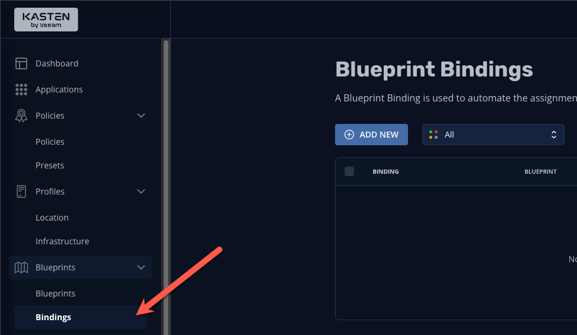

2. Click **+ Add New**

3. Specify the following:
 
   | **Binding Name**             | pacman-backup |
   | **Blueprint Name**           | mongo-hooks   |
   | **Enable Blueprint Binding** | [checked]     |

4. Click **Next**

5. We'll now specify a constraint to ensure that our blueprint is bound to our application.  We'll use a simple "**Match All Constraints**" constraint to apply
our blueprint to our pacman application via namespace. Click **Add New Constraint** and select **Namespace** in the drop-down list:

    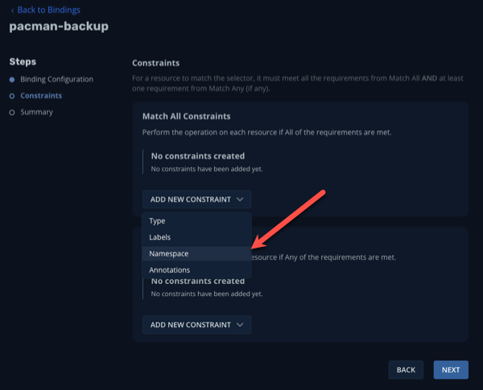

6. Leave the default Operator of **In** and specify the namespace **Pacman**

7. Still in the **Match All Constraints** pane, click **Add New Constraint** and select **Type**

    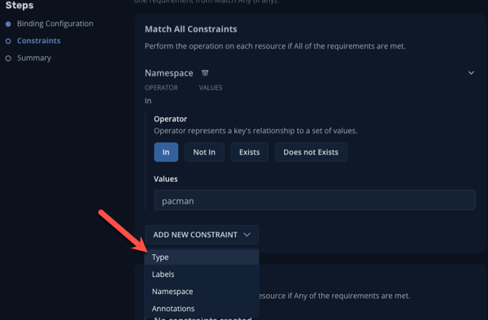

8. Leave the default Operator of **In** and specify **Type**

9. For the **Type** Constraint, specify the following:

    | **Group**    | [leave blank]  |
    | **Version**  | [leave blank]  |
    | **Resource** | deployments    |
    | **Name**     | pacman-mongodb |

10. Click **Next**

11. Click **Submit**

    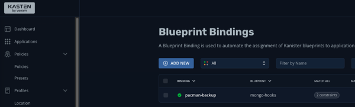

    {: .note }
    > Rather than use bindings via the UI, we could simply annotate the deployment to point it to the `mongo-hook`
    > blueprint we created earlier
    > ```kubectl annotate deployment pacman-mongodb kanister.kasten.io/blueprint='mongo-hooks' -n pacman```

12. Using the navigation menu to the left, click **Applications** then click on **Pacman** in the list. A modul will appear outlining the application components,
and you should see the blueprint we just created automatically bound to the **pacman-mongodb** deployment:

    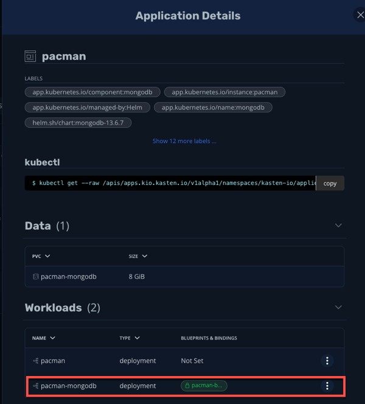
    
    Now when we run our previously configured backup job **pacman-backup**, our blueprint will automatically run to pause database operations on our Pacman score
    database.

13. Close the **Application Details** modul by clicking the **X** in the upper right corner and navigate to **Policies** using the left-hand pane.

14. Click **Run Once** on the **pacman-backup** policy

    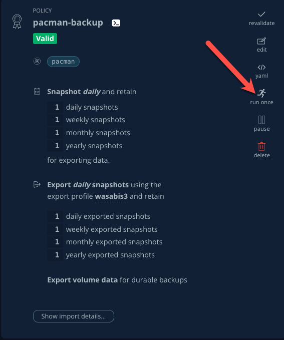

15. Click **Yes, Continue** when prompted.

16. Click on **Dashboard** in the left navigate pane to monitor the backup policy run action and under the **Actions** section, click on the running **Policy Run** action.

15. All phases should complete successfully and we have taken an **Application Consistent** backup of our Pacman Application. Rejoice!

    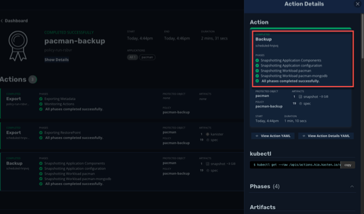


Part 4. Takeaways
====================

- Kasten supports multiple backup types, including crash consistent, application consistent, and logical
- Application consistent and logical backups are performed via **Kanister Blueprints**
- The **Kanister Project** is an open source project with community-authored blueprints
- Blueprints are bound to workloads via **Blueprint Bindings** which can be applied via a number of ways within the UI or YAML directly


🏁 Part 5. Conclusion
=====================

Congratulations, you finished the Kasten Demo on Red Hat OpenShift! While we only covered a simple crash consistent and application consistent
backup and restore in this demo, Kasten can do much more, such as:

- Backup and protect off-cluster workloads (e.g. RDS, Azure CosmosDB, etc)
- Backup and protect OpenShift Virtualization VM workloads
- Prevent data loss and help you quickly recover in the event of a disaster (e.g. a Ransomware attack)
- Migrate application and VM workloads from non-OpenShift K8s clusters to OpenShift
- Migrate workloads from on-premises to the cloud, or vice versa
- Integrate with CI/CD pipelines to automatically backup and protect workloads as they are deployed


**To learn more visit [kasten.io](https://kasten.io)**